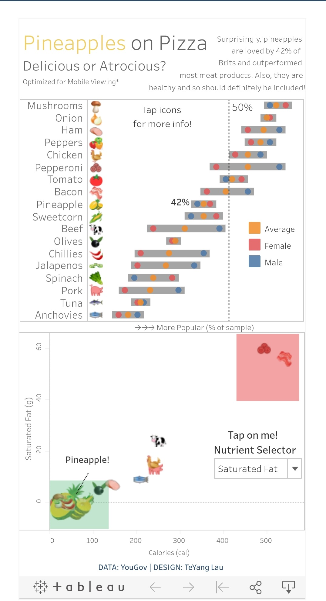

# Samples of my Tableau Dashboards Visualizations

### Here I display some static images of my Tableau dashboards. To get a better view of them with interactive functions, click on them and it will link to the tableau dashboard. Try it out! ###

## World Happiness Report 2020

## Pineapples on Pizza: Mobile Version
<a href="https://public.tableau.com/profile/teyang.lau#!/vizhome/PizzaonPineapples/Dashboard2">

## How much do Americans Sleep???

